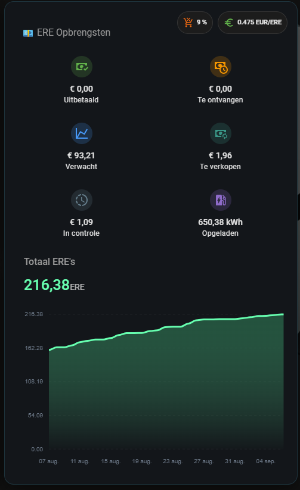

# Joulo for Home Assistant

A [HACS](https://hacs.xyz/) custom integration for [Joulo](https://joulo.nl) — pulls charger
status, active charging sessions, and lifetime energy/ERE statistics from the
[Joulo API](https://developer.joulo.nl/) into Home Assistant.

## Entities

Per linked charger (one HA device each):

| Entity | Source | Poll interval |
|---|---|---|
| `sensor.<charger>_status` | `GET /chargers` | 60s |
| `binary_sensor.<charger>_charging` | `GET /chargers` | 60s |
| `sensor.<charger>_session_energy` | `GET /chargers` | 60s |
| `sensor.<charger>_active_tag_id` | `GET /chargers` | 60s |
| `sensor.<charger>_meter_reading` (disabled by default) | `GET /chargers` | 60s |

`active_tag_id` is the RFID/TAG id of the currently active session (e.g. to
identify the vehicle/driver behind a charge) — `unknown` when no session is
active.

Account-wide (one "Joulo account" device):

| Entity | Source | Poll interval |
|---|---|---|
| `sensor.joulo_total_energy` | `GET /energy` | 1h |
| `sensor.joulo_total_ere_credits` | `GET /energy` | 1h |
| `sensor.joulo_total_sessions` | `GET /energy` | 1h |
| `sensor.joulo_ere_compliance_year` (diagnostic) | `GET /ere-position` | 1h |
| `sensor.joulo_ere_paid` | `GET /ere-position` | 1h |
| `sensor.joulo_ere_payable` | `GET /ere-position` | 1h |
| `sensor.joulo_ere_reserved` | `GET /ere-position` | 1h |
| `sensor.joulo_ere_unsold_forecast` (total) | `GET /ere-position` | 1h |
| `sensor.joulo_ere_unsold_future_forecast` (rest of year) | `GET /ere-position` | 1h |
| `sensor.joulo_ere_unsold_ytd_forecast` (year to date) | `GET /ere-position` | 1h |
| `sensor.joulo_ere_unsold_ytd_ere` (credits, year to date) | `GET /ere-position` | 1h |
| `sensor.joulo_ere_pending_forecast` (in review) | `GET /ere-position` | 1h |
| `sensor.joulo_ere_pending_ere` (credits, in review) | `GET /ere-position` | 1h |
| `sensor.joulo_ere_ytd_expected` | `GET /ere-position` | 1h |
| `sensor.joulo_ere_total_expected` | `GET /ere-position` | 1h |
| `sensor.joulo_ere_indicative_price` (diagnostic) | `GET /ere-position` | 1h |
| `sensor.joulo_ere_realized_avg_price` (diagnostic) | `GET /ere-position` | 1h |
| `sensor.joulo_ere_paid_price_per_ere` (diagnostic) | `GET /ere-position` | 1h |
| `sensor.joulo_ere_fee_pct` (diagnostic) | `GET /ere-position` | 1h |
| `sensor.joulo_ere_allocatable` (diagnostic) | `GET /ere-position` | 1h |
| `sensor.joulo_ere_forecast_confidence` (diagnostic) | `GET /ere-position` | 1h |
| `sensor.joulo_ere_forecast_history` (diagnostic) | `GET /ere-position` | 1h |
| `sensor.joulo_ere_current_quarter` (diagnostic) | `GET /ere-position` | 1h |
| `sensor.joulo_ere_current_quarter_price_per_ere` (diagnostic) | `GET /ere-position` | 1h |
| `sensor.joulo_ere_current_quarter_sold_ere` | `GET /ere-position` | 1h |
| `sensor.joulo_ere_current_quarter_unsold_ere` | `GET /ere-position` | 1h |
| `sensor.joulo_ere_current_quarter_realized` | `GET /ere-position` | 1h |

The `ere_indicative_price` sensor also carries the quarterly price breakdown
(`quarters`) from the API as an extra state attribute. All euro-denominated
`ere_*` figures other than `ere_paid` are Joulo's own forecasts/estimates and
can move up or down as market prices and allocations change.

The `ere_current_quarter*` sensors track whichever quarter the API marks as
in-progress (`final: false`) and roll over to the next quarter automatically
— no reconfiguration needed when a new quarter starts. `ere_current_quarter_realized`
also carries a `net_eur_by_status` (paid/payable/reserved) breakdown as an
extra state attribute.

New chargers added in the Joulo dashboard appear automatically on the next poll,
no reload required.

## Example dashboard



A Lovelace dashboard built entirely from the `ere_*` account sensors above. Requires
three HACS frontend resources: [mushroom](https://github.com/piitaya/lovelace-mushroom),
[apexcharts-card](https://github.com/RomRider/apexcharts-card), and
[card-mod](https://github.com/thomasloven/lovelace-card-mod) (install all three via
HACS → Frontend, then add them as dashboard resources if not done automatically).

The entity IDs below are Dutch, since Home Assistant derives an entity's ID from its
translated name at creation time and this dashboard was built against an instance
running in Dutch (`nl`). On an English (`en`) instance, swap in the IDs from the
right-hand column instead:

| Sensor | Dutch entity ID (example below) | English entity ID |
|---|---|---|
| Total ERE credits | `sensor.joulo_account_totaal_ere_credits` | `sensor.joulo_account_total_ere_credits` |
| ERE paid out | `sensor.joulo_account_ere_uitbetaald` | `sensor.joulo_account_ere_paid_out` |
| ERE payable | `sensor.joulo_account_ere_nog_te_ontvangen` | `sensor.joulo_account_ere_payable` |
| ERE expected revenue (YTD) | `sensor.joulo_account_ere_verwachte_opbrengst_dit_jaar` | `sensor.joulo_account_ere_expected_revenue_year_to_date` |
| ERE platform fee | `sensor.joulo_account_ere_platformkosten` | `sensor.joulo_account_ere_platform_fee` |
| ERE realized average price | `sensor.joulo_account_ere_gerealiseerde_gemiddelde_prijs` | `sensor.joulo_account_ere_realized_average_price` |

If neither column matches what you see, check Developer Tools → States for the actual
IDs — they depend on the language HA was set to when the Joulo integration was added.

<details>
<summary>Dashboard YAML</summary>

```yaml
type: vertical-stack
cards:
  - type: horizontal-stack
    cards:
      - type: custom:mushroom-title-card
        subtitle: 💶 ERE Opbrengsten
      - type: custom:mushroom-chips-card
        alignment: end
        chips:
          - type: entity
            entity: sensor.joulo_account_ere_platformkosten
            name:
              - type: text
                text: Fee
              - type: entity
            icon: mdi:cart-percent
            icon_color: deep-orange
            content_info: state
          - type: entity
            entity: sensor.joulo_account_ere_gerealiseerde_gemiddelde_prijs
            icon: mdi:currency-eur
            icon_color: green
  - type: horizontal-stack
    cards:
      - type: custom:mushroom-entity-card
        entity: sensor.joulo_account_ere_uitbetaald
        name: Uitbetaald
        icon: mdi:cash-check
        icon_color: green
        layout: vertical
        primary_info: state
        secondary_info: name
        card_mod:
          style: |
            ha-card {
              background: #12161a;
              border-radius: 16px;
              border: 1px solid rgba(0, 212, 255, 0.15);
              box-shadow: 0 10px 30px rgba(0, 0, 0, 0.5);
            }
      - type: custom:mushroom-entity-card
        entity: sensor.joulo_account_ere_nog_te_ontvangen
        name: Te ontvangen
        icon: mdi:cash-clock
        icon_color: orange
        layout: vertical
        primary_info: state
        secondary_info: name
        card_mod:
          style: |
            ha-card {
              background: #12161a;
              border-radius: 16px;
              border: 1px solid rgba(0, 212, 255, 0.15);
              box-shadow: 0 10px 30px rgba(0, 0, 0, 0.5);
            }
      - type: custom:mushroom-entity-card
        entity: sensor.joulo_account_ere_verwachte_opbrengst_dit_jaar
        name: Verwacht
        icon: mdi:chart-line
        icon_color: blue
        layout: vertical
        primary_info: state
        secondary_info: name
        card_mod:
          style: |
            ha-card {
              background: #12161a;
              border-radius: 16px;
              border: 1px solid rgba(0, 212, 255, 0.15);
              box-shadow: 0 10px 30px rgba(0, 0, 0, 0.5);
            }
  - type: custom:apexcharts-card
    card_mod:
      style: |
        ha-card {
          background: #12161a;
          border-radius: 16px;
          border: 1px solid rgba(0, 212, 255, 0.15);
          box-shadow: 0 10px 30px rgba(0, 0, 0, 0.5);
          padding: 12px;
        }
        .apexcharts-tooltip {
          background: #1e252b !important;
          border: 1px solid #00d4ff !important;
        }
    header:
      show: true
      title: Totaal ERE's
      show_states: false
      colorize_states: false
    graph_span: 31d
    span:
      end: day
    update_interval: 10m
    yaxis:
      - id: credits
        min: 0
        apex_config:
          forceNiceScale: true
          decimalsInFloat: 2
          tickAmount: 4
          labels:
            style:
              colors: "#6c7a89"
              fontSize: 10px
    apex_config:
      chart:
        toolbar:
          show: false
      legend:
        show: false
      stroke:
        curve: smooth
      plotOptions:
        bar:
          borderRadius: 4
          columnWidth: 70%
      fill:
        type: gradient
        gradient:
          type: vertical
          opacityFrom: 0.75
          opacityTo: 0.1
          stops:
            - 0
            - 100
      grid:
        strokeDashArray: 4
        borderColor: rgba(255, 255, 255, 0.05)
      xaxis:
        axisBorder:
          show: false
        axisTicks:
          show: false
        labels:
          style:
            colors: "#6c7a89"
            fontSize: 10px
    series:
      - entity: sensor.joulo_account_totaal_ere_credits
        type: area
        name: Totaal Credits
        yaxis_id: credits
        unit: ERE
        color: "#00ffb3"
        stroke_width: 3
        float_precision: 2
        group_by:
          duration: 1d
          func: max
        show:
          extremas: max
          in_header: true
```

</details>

## Configuration

Both are available on an already-added entry from Settings → Devices & services → Joulo,
no need to remove and re-add:

- **⋮ → Reconfigure** — swap in a new personal API token (e.g. after rotating it in the
  Joulo dashboard) without recreating the entry or losing entity history.
- **⋮ → Configure** (options) — tune the poll interval (in seconds) for each of the three
  endpoints (chargers, energy, ERE position) independently. Changing a value reloads the
  entry immediately with the new intervals.

## Installation

### Via HACS

1. HACS → Integrations → ⋮ → Custom repositories → add this repo URL, category "Integration".
2. Install "Joulo", restart Home Assistant.
3. Settings → Devices & services → Add integration → "Joulo".
4. Paste a personal API token from the Joulo dashboard (Settings → API → Activate).

### Manual

Copy `custom_components/joulo` into your Home Assistant `config/custom_components/`
directory and restart.

## Development

This repo is set up to be opened in VS Code's Dev Containers using Docker Desktop —
it builds a container with a "fake" Home Assistant instance for testing the
integration live, following the same pattern as the official
[integration blueprint](https://github.com/ludeeus/integration_blueprint).

1. Install the [Dev Containers](https://marketplace.visualstudio.com/items?itemName=ms-vscode-remote.remote-containers)
   VS Code extension (Docker Desktop must be running).
2. Open this folder in VS Code → "Reopen in Container" when prompted.
3. Wait for `scripts/setup` to finish installing Home Assistant + test deps.
4. Run the **"Run Home Assistant"** task (Terminal → Run Task…), or from a
   container terminal: `bash scripts/develop`.
5. Open http://localhost:8123, complete onboarding, then add the "Joulo"
   integration and enter a real API token to test against the live API.

`custom_components/joulo` is symlinked into `config/custom_components`, so
edits are picked up on restart — no rebuild needed. Home Assistant restarts
can be triggered from Developer Tools → YAML, or by re-running the task.

### Tests

```bash
pytest tests
```

### Lint

```bash
bash scripts/lint
```

